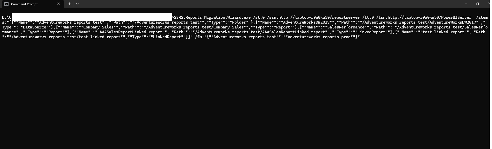

# Automation (Preview)

With the SSRS Reports Migration Wizard (SRMW) command-line utility, you can automate routine migrations in a few clicks. The migration script can be integrated with any scheduler or CI/CD tool.



## Parameters

`SSRS.Reports.Migration.Wizard.exe` initiates the migration using the parameters specified on the command line.

Below is a table summarizing the parameters for the command-line utility.

| Parameter | Usage | Description |
|-----------|-------|-------------|
| st | Mandatory | Source type. `0` = SSRS / Power BI Report Server, `1` = SRMW file. |
| ssn | Mandatory when st = 0 | Source report server URL. e.g. `http://servername/ReportServer` |
| su | Optional when st = 0 | Source username. Supports `DOMAIN\username`, `username@domain.com`, or plain `username` format. When not specified, Windows authentication is used. |
| sp | Optional when st = 0 | Source password. Required when `su` is specified. |
| tt | Mandatory | Target type. `0` = SSRS / Power BI Report Server, `1` = SRMW file. |
| tsn | Mandatory when tt = 0 | Target report server URL. e.g. `http://servername/ReportServer` |
| tu | Optional when tt = 0 | Target username. Supports `DOMAIN\username`, `username@domain.com`, or plain `username` format. When not specified, Windows authentication is used. |
| tp | Optional when tt = 0 | Target password. Required when `tu` is specified. |
| srmwfp | Mandatory when st or tt = 1 | Full path of the SRMW file. e.g. `D:\Exports\backup.srmw` |
| items | Optional | Specify SSRS items to migrate in JSON format. See usage examples below. When not specified, the entire catalog from the source will be migrated to the target. |
| fm | Optional | Source to target folder mapping in JSON format. e.g. `{"Source Folder":"Target Folder"}`. When specified, items in the source folder will be migrated to the mapped target folder name on the target. Folder renaming is applied automatically when this parameter is provided.|
| ms | Optional | Migrate subscriptions. Possible values are `true` and `false`. Default is `false`. When set to `true`, report subscriptions and shared schedules will be migrated to the target. |
| mr | Optional | Migrate roles. Possible values are `true` and `false`. Default is `false`. When set to `true`, item-level role assignments will be migrated to the target. |
| mp | Optional | Migrate report parameters and defaults. Possible values are `true` and `false`. Default is `false`. When set to `true`, report parameter default values will be applied on the target after migration. |
| lfd | Optional | Log file directory. Used to record execution logs and errors during migration. When not specified, the application will write the log at the user's default location. |

## Before You Begin

Before running the command-line utility, you need to make the executable accessible from any command prompt location. You can do this in one of two ways:

**Option 1 — Add to Windows Environment Variables (Recommended)**

1. Open **Windows Start** and search for **"Environment Variables"**
2. Click **"Edit the system environment variables"**
3. Click **"Environment Variables..."**
4. Under **System variables**, select **Path** and click **"Edit..."**
5. Click **"New"** and paste the full folder path where `SSRS.Reports.Migration.Wizard.exe` is installed. e.g. `C:\Program Files\AzureOps\SSRS Reports Migration Wizard`
6. Click **OK** on all dialogs
7. Open a new command prompt and run:

```
SSRS.Reports.Migration.Wizard.exe /?
```

If the executable is found, you are ready to run migrations from any directory.

**Option 2 — Use the full path in your command**

If you prefer not to modify environment variables, prefix every command with the full path to the executable:

```powershell
"C:\Program Files\AzureOps\SSRS Reports Migration Wizard\SSRS.Reports.Migration.Wizard.exe" /st:0 /ssn:http://SourceServer/ReportServer /tt:0 /tsn:http://TargetServer/ReportServer
```

{: .note }
> If the installation path contains spaces, always wrap it in double quotes as shown above.

## Limitations

### Data Source Credentials

The command-line utility migrates data source definitions as-is from the source server. It does not support interactively reviewing or updating data source connection strings or credentials during migration, unlike the wizard UI which provides a **Update Data Source Connections** step.

As a result, if the target server uses different credentials or connection strings than the source, migrated reports may fail to execute until the data sources are manually reconfigured on the target.

**Recommended approach before running `/ms:true`:**

1. Run the migration once without `/ms:true` to migrate all items and data sources first.
2. Log into the target report server and verify all data sources are correctly configured and can connect successfully.
3. Re-run the migration with `/ms:true` to transfer subscriptions once data sources are confirmed working.

> Subscriptions that reference a data source with missing or incorrect credentials will fail to execute on the target server even if the subscription itself is transferred successfully.

### Subscription Credentials

Subscription delivery credentials (e.g. file share username and password for file delivery subscriptions) are not stored in the SSRS catalog and therefore cannot be exported or migrated automatically. After migration, file share and email delivery subscriptions may need their delivery credentials re-entered manually on the target server.

## Items parameter format

The `items` parameter accepts a JSON array. Each object must include `Name`, `Path`, and `Type`.

Supported `Type` values: `Folder`, `Report`, `LinkedReport`, `DataSource`, `DataSet`.

> **Important:** Always include the parent folder of any item in the list. If the parent folder does not exist on the target server, all items inside it will fail to migrate.

```json
[
  { "Name": "Sales", "Path": "/Sales", "Type": "Folder" },
  { "Name": "AdventureWorks", "Path": "/Sales/AdventureWorks", "Type": "DataSource" },
  { "Name": "Company Sales", "Path": "/Sales/Company Sales", "Type": "Report" },
  { "Name": "Sales Summary", "Path": "/Sales/Sales Summary", "Type": "LinkedReport" }
]
```

## Usage examples

Add the folder path of `SSRS.Reports.Migration.Wizard.exe` to the Windows system environment variable `Path`. Alternatively, specify the full path of the executable in the command prompt.

---

Migrate the entire SSRS catalog from one report server to another using Windows authentication.

```powershell
SSRS.Reports.Migration.Wizard.exe /st:0 /ssn:http://SourceServer/ReportServer /tt:0 /tsn:http://TargetServer/ReportServer
```

---

Migrate the entire SSRS catalog from one report server to another including subscriptions, roles, and parameters, with logs written to a custom directory.

```powershell
SSRS.Reports.Migration.Wizard.exe /st:0 /ssn:http://SourceServer/ReportServer /tt:0 /tsn:http://TargetServer/ReportServer /ms:true /mr:true /mp:true /lfd:"D:\Logs"
```

---

Migrate the entire SSRS catalog using explicit credentials.

```powershell
SSRS.Reports.Migration.Wizard.exe /st:0 /ssn:http://SourceServer/ReportServer /su:DOMAIN\username /sp:MyPassword /tt:0 /tsn:http://TargetServer/ReportServer /tu:DOMAIN\username /tp:MyPassword /ms:true /mr:true /mp:true /lfd:"D:\Logs"
```

---

Migrate the entire SSRS catalog using UPN format credentials.

```powershell
SSRS.Reports.Migration.Wizard.exe /st:0 /ssn:http://SourceServer/ReportServer /su:kunal@contoso.com /sp:MyPassword /tt:0 /tsn:http://TargetServer/ReportServer /tu:kunal@contoso.com /tp:MyPassword
```

---

Export the entire SSRS catalog from a report server to an SRMW file for backup or offline transfer.

```powershell
SSRS.Reports.Migration.Wizard.exe /st:0 /ssn:http://SourceServer/ReportServer /tt:1 /srmwfp:"D:\Backups\SSRSBackup.srmw" /lfd:"D:\Logs"
```

---

Import an SRMW file to a target report server with all options enabled.

```powershell
SSRS.Reports.Migration.Wizard.exe /st:1 /srmwfp:"D:\Backups\SSRSBackup.srmw" /tt:0 /tsn:http://TargetServer/ReportServer /ms:true /mr:true /mp:true /lfd:"D:\Logs"
```

---

Migrate from SSRS to Power BI Report Server.

```powershell
SSRS.Reports.Migration.Wizard.exe /st:0 /ssn:http://SourceServer/ReportServer /tt:0 /tsn:http://PBIServer/PowerBIReportServer /ms:true /mr:true /mp:true /lfd:"D:\Logs"
```

---

Migrate specific items by specifying them explicitly. Always include the parent folder.

```powershell
SSRS.Reports.Migration.Wizard.exe /st:0 /ssn:http://SourceServer/ReportServer /tt:0 /tsn:http://TargetServer/ReportServer /items:"[{""Name"":""Finance"",""Path"":""/Finance"",""Type"":""Folder""},{""Name"":""FinanceDB"",""Path"":""/Finance/FinanceDB"",""Type"":""DataSource""},{""Name"":""Revenue Report"",""Path"":""/Finance/Revenue Report"",""Type"":""Report""},{""Name"":""Revenue Summary"",""Path"":""/Finance/Revenue Summary"",""Type"":""LinkedReport""}]" /ms:true /mp:true /lfd:"D:\Logs"
```

---

Migrate all items and rename a folder on the target server. Specifying `/fm` is sufficient — folder renaming is applied automatically.

```powershell
SSRS.Reports.Migration.Wizard.exe /st:0 /ssn:http://SourceServer/ReportServer /tt:0 /tsn:http://TargetServer/ReportServer /fm:"{""Sales Staging"":""Sales Production""}" /lfd:"D:\Logs"
```

---

Schedule a nightly migration using Windows Task Scheduler by saving the command in a `.bat` file.

```bat
@echo off
SSRS.Reports.Migration.Wizard.exe /st:0 /ssn:http://SourceServer/ReportServer /tt:0 /tsn:http://TargetServer/ReportServer /ms:true /mr:true /mp:true /lfd:"D:\Logs\Nightly"
```

Save as `nightly_migration.bat` and configure Windows Task Scheduler to run it on your desired schedule.

## Exit codes

| Code | Meaning |
|------|---------|
| 0 | Success |
| -1 | Failure |
| -2 | Fatal error during initialisation |

{: .note }
> **Security Note:** Avoid passing passwords directly as command-line arguments 
> (`/sp`, `/tp`) as they may be visible in process listings and shell history. 
> Where possible, use Windows Authentication by omitting `/su`/`/sp` entirely, 
> or store passwords in environment variables and reference them in your script.

