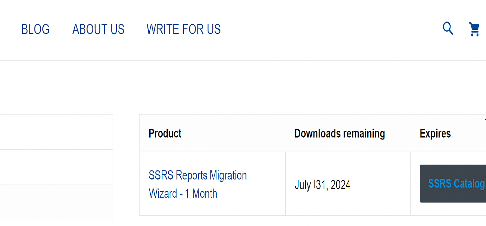
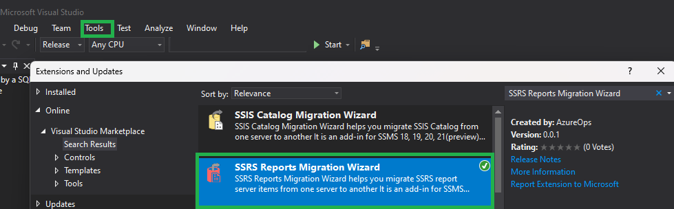
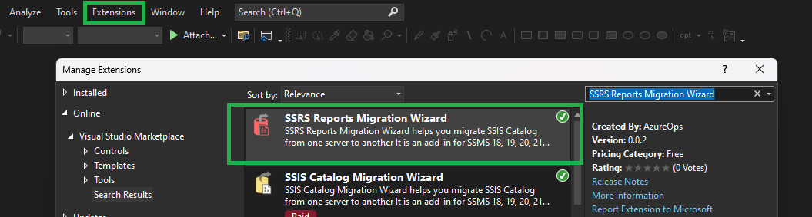

# Installation and Activation

## How to Download 

Once you have ordered the product license from [azureops.org](https://azureops.org/product/ssrs-reports-migration-wizard/), login to your account and navigate to [downloads](https://azureops.org/my-account/downloads/) page. Download the zip file. Alternatively, you will receive a link to download the software by email.

**Visual Studio 2017/2019**

1. Open Visual Studio 2017 or 2019. 
2. Click on the ‘Tools’ menu item, then select ‘Extensions and Updates’.
3. Under `Online` section, search for `SSRS Reports Migration Wizard` and click `Download`.
3. Once the download is done, restart Visual Studio and complete the installation.
4. Click on the ‘Tools‘ menu item. You will see the `SSRS Reports Migration Wizard` option. Click it to launch.

**Visual Studio 2022**

1. Open Visual Studio 2022. 
2. Click on the ‘Extensions’ menu item, then select ‘Manage Extensions’.
3. Under `Online` section, search for `SSRS Reports Migration Wizard` and click `Download`.
3. Once the download is done, restart Visual Studio and complete the installation.
4. Click on the ‘Tools‘ menu item. You will see the `SSRS Reports Migration Wizard` option. Click it to launch.

**SQL Server Management Studio 18**

[Download Visual Studio 2017/2019 Extension](https://marketplace.visualstudio.com/items?itemName=AzureOps.elasticjobsmanager1719){: .btn .btn-purple .mr-2 }

1. Extract the file `SSRS.Reports.Migration.Wizard.vsix` content in a folder named `SSRS Reports Migration Wizard` using 7zip.
2. Copy this folder to the location `C:\Program Files (x86)\Microsoft SQL Server Management Studio 18\Common7\IDE\Extensions`. You would need admin permissions to do this.
3. Restart SSMS 18.
4. You will now see the `SSRS Reports Migration Wizard` option under the Tools menu item. Click it to Launch.

**SQL Server Management Studio 19**

[Download Visual Studio 2017/2019 Extension](https://marketplace.visualstudio.com/items?itemName=AzureOps.elasticjobsmanager1719){: .btn .btn-purple .mr-2 }

1. Extract the file `SSRS.Reports.Migration.Wizard.vsix` content in a folder named `SSRS Reports Migration Wizard` using 7zip.
2. Copy this folder to the location `C:\Program Files (x86)\Microsoft SQL Server Management Studio 19\Common7\IDE\Extensions`. You would need admin permissions to do this.
3. Restart SSMS 19.
4. You will now see the `SSRS Reports Migration Wizard` option under the Tools menu item. Click it to Launch.

**Standalone Installation**
1. Extract the file `SSRS.Reports.Migration.Wizard.vsix` content in a folder named `SSRS Reports Migration Wizard` using 7zip.
2. Place this folder in your preferred location and double-click the `SSRS.Reports.Migration.Wizard.exe` file, to launch the application.

## Activate License Key

You will receive the license key via email. You can also find the license key at [my-accounts](https://azureops.org/my-account/view-license-keys/). 
Launch SSIS Cataloger Installer.exe and enter the product key on the landing page screen and click on the `Activate Product` button. 
It should activate the product on the machine.

## Deactivate License Key (Danger)

If you want to deactivate the product key, you can launch SSIS Cataloger Installer.exe and click the `Deactivate Product` button. This action is irreversible, and you cannot reactivate the product with the same product key.

