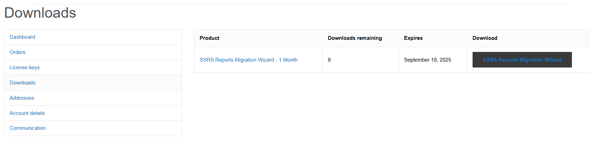
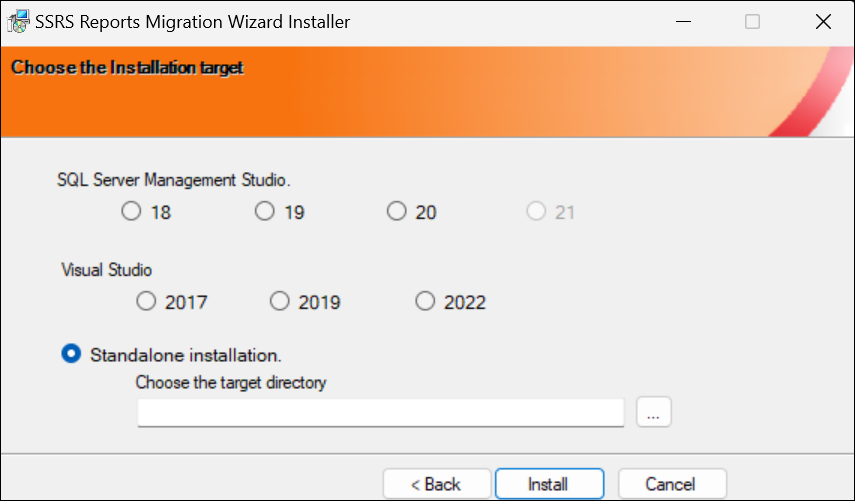

# Installation and Activation
{: .no_toc }

## Table of contents
{: .no_toc .text-delta }

1. TOC
{:toc}

## Order a License Key

Unlock the full power of SSRS Reports Migration Wizard by purchasing a license key.
The licensed version removes trial limitations and enables complete migration of your SSRS reports, datasets, data sources, subscriptions, roles, and much more.

[Get License Key](https://azureops.org/product/ssrs-reports-migration-wizard/){: .btn .btn-green .mr-2 }

## Download the Installer

 Login to your account and navigate to [downloads](https://azureops.org/my-account/downloads/) page. Download the zip file. Alternatively, you will receive a link to download the software by email.

## Activate License Key

You will receive the license key via email. You can also find the license key at [my-accounts](https://azureops.org/my-account/view-license-keys/). 
Launch SSRS Report Migration Wizard Installer.exe and enter the product key on the landing page screen and click on the `Activate Product` button. 
It should activate the product on the machine.

## Choose an Installation Target

1. Launch SSRS Report Migration Wizard Installer.exe and click Next.
2. Choose the installation target from SQL Server Management Studio (SSMS), Visual Studio or Standalone installation.
3. Click Install

## Manual Installation from Visual Studio Marketplace

**Visual Studio 2017/2019**

1. Open Visual Studio 2017 or 2019. 
2. Click on the ‘Tools’ menu item, then select ‘Extensions and Updates’.
3. Under `Online` section, search for `SSRS Reports Migration Wizard` and click `Download`.
4. Once the download is done, restart Visual Studio and complete the installation.
   

Click on the ‘Tools‘ menu item. You will see the `SSRS Reports Migration Wizard` option. Click it to launch.

**Visual Studio 2022/2026**

1. Open Visual Studio 2022 or 2026. 
2. Click on the ‘Extensions’ menu item, then select ‘Manage Extensions’.
3. Under `Online` section, search for `SSRS Reports Migration Wizard` and click `Download`.
4. Once the download is done, restart Visual Studio and complete the installation.

Click on the ‘Tools‘ menu item. You will see the `SSRS Reports Migration Wizard` option. Click it to launch.

**SQL Server Management Studio 18**

[Download Visual Studio 2017/2019 Extension](https://marketplace.visualstudio.com/items?itemName=AzureOps.elasticjobsmanager1719){: .btn .btn-purple .mr-2 }

1. Extract the file `SSRS.Reports.Migration.Wizard.vsix` content in a folder named `SSRS Reports Migration Wizard` using 7zip.
2. Copy this folder to the location `C:\Program Files (x86)\Microsoft SQL Server Management Studio 18\Common7\IDE\Extensions`. You would need admin permissions to do this.
3. Restart SSMS 18.
4. You will now see the `SSRS Reports Migration Wizard` option under the Tools menu item. Click it to Launch.

**SQL Server Management Studio 19**

[Download Visual Studio 2017/2019 Extension](https://marketplace.visualstudio.com/items?itemName=AzureOps.elasticjobsmanager1719){: .btn .btn-purple .mr-2 }

1. Extract the file `SSRS.Reports.Migration.Wizard.vsix` content in a folder named `SSRS Reports Migration Wizard` using 7zip.
2. Copy this folder to the location `C:\Program Files (x86)\Microsoft SQL Server Management Studio 19\Common7\IDE\Extensions`. You would need admin permissions to do this.
3. Restart SSMS 19.
4. You will now see the `SSRS Reports Migration Wizard` option under the Tools menu item. Click it to Launch.

Follow simillar steps to install the plugin for SSMS 20/21/22.

**Standalone Installation**
1. Extract the file `SSRS.Reports.Migration.Wizard.vsix` content in a folder named `SSRS Reports Migration Wizard` using 7zip.
2. Place this folder in your preferred location and double-click the `SSRS.Reports.Migration.Wizard.exe` file, to launch the application.

## Deactivate License Key (Danger)

If you want to deactivate the product key, you can launch SSRS Report Migration Wizard Installer.exe and click the `Deactivate Product` button. This action is irreversible, and you cannot reactivate the product with the same product key.

