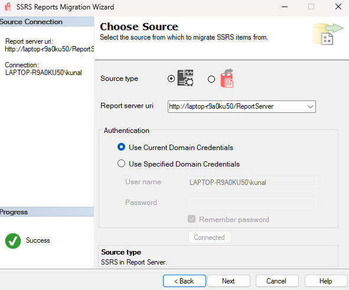
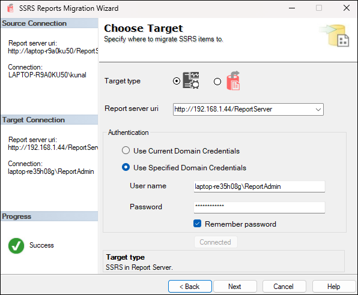
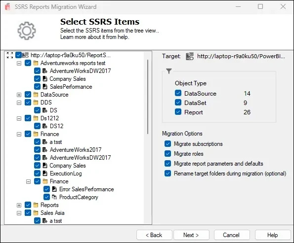
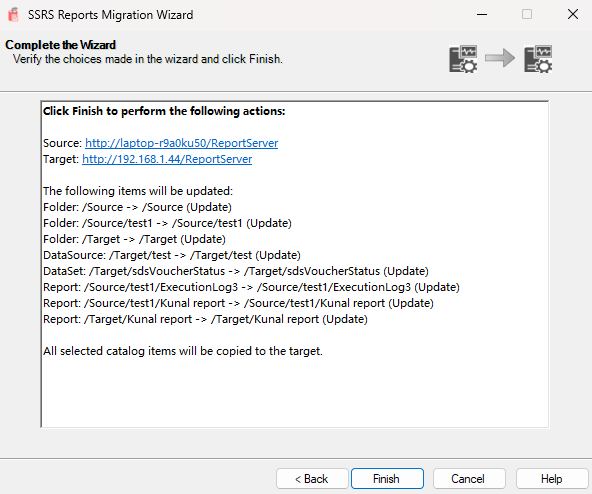
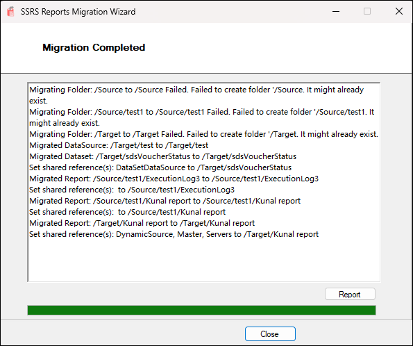

# Getting started
{: .no_toc }

## Choose Source

- Choose the **source type**: either an SSRS Report Server or an SRMW file.
- Enter the **Report Server URI** (e.g., `http://localhost/ReportServer`).
- Select the **authentication method**:
  - Use Current Domain Credentials
  - Use Specified Domain Credentials (provide domain\username and password)
 

Click **Next** to proceed.

## Choose Target

- Choose the **target type**: another SSRS Report Server or SRMW file.
- Enter the **target server URI**.
- Provide authentication details as needed.

Click **Next** to continue.

## Select SSRS Items to Migrate

- Browse and select specific SSRS objects (folders, reports, datasets, data sources).
- The tool displays a **tree view** of your SSRS folder hierarchy.
- You can preview object counts by type on the right panel.
- Optionally, check **"Migrate standard subscriptions"** to include subscriptions.

> ⚠️ **Important Limitation:**  
> Stored credentials from data sources, datasets, and reports **are not migrated** by this wizard.  
> If these credentials are missing, **standard subscriptions will fail to migrate**.  
> **Recommendation:** First complete the SSRS item migration. Then, **manually set credentials** on the target server. After credentials are set, rerun the wizard to migrate subscriptions successfully.

Click **Next** once you’ve selected the required items.

## Review and Confirm

- Review the source and target server details.
- A detailed list of items to be updated will be shown.
- The summary includes folder and item-level actions.

Click **Finish** to start the migration process.

## Migration Summary

- View a detailed log of all migrated items.
- Warnings about existing folders or skipped operations will be shown.
- Click **Report** to view a full migration log or **Close** to exit the wizard.

⚠️ **Limitations**

- This wizard cannot transfer **stored credentials** from reports, data sources, or datasets. You must configure credentials manually on the target server after migration.
- If credentials are not configured, **standard subscriptions will fail to migrate properly**.
- **Data-driven subscriptions are not supported.**
- Only **Native mode SSRS servers** are supported — **SharePoint mode is not supported**.
✅ Recommended approach:
1. Migrate all SSRS items first.
2. Set credentials manually on the target server.
3. Rerun the wizard with the "Standard Subscription Migration" option selected.

