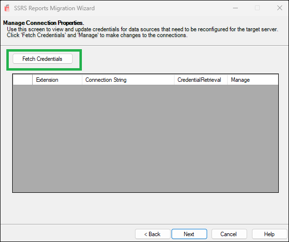
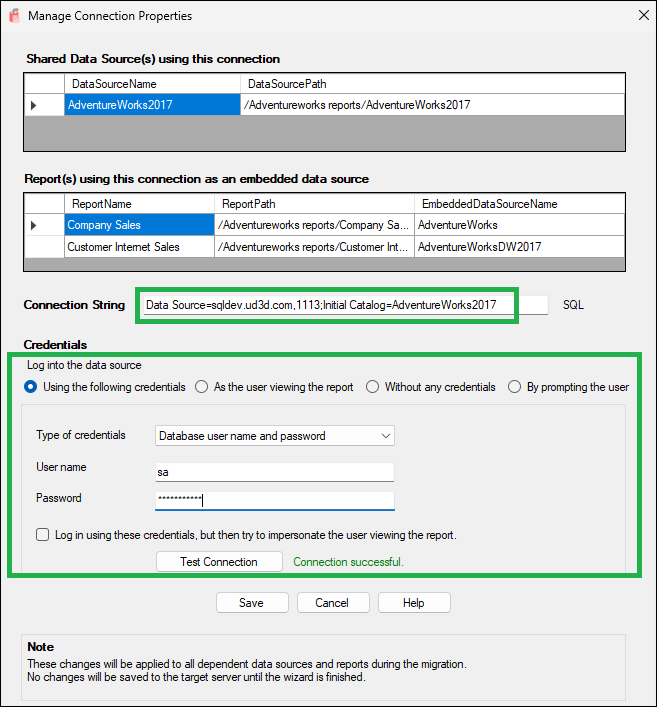

# Getting Started
{: .no_toc }

## Choose Source

- Choose the **source type**: either an SSRS Report Server or an SRMW file.
- Enter the **Report Server URI** (e.g., `http://localhost/ReportServer`).
- Select the **authentication method**:
  - Use Current Domain Credentials
  - Use Specified Domain Credentials (provide domain\username and password)
 

Click **Next** to proceed.

## Choose Target

- Choose the **target type**: another SSRS Report Server or SRMW file.
- Enter the **target server URI**.
- Provide authentication details as needed.

Click **Next** to continue.

## Select SSRS Items to Migrate

- Browse and select specific SSRS objects (folders, reports, datasets, data sources).
- The tool displays a **tree view** of your SSRS folder hierarchy.
- You can preview object counts by type on the right panel.
- Optionally, check **"Migrate standard subscriptions"** to include subscriptions.

Click **Next** once you’ve selected the required items.

## Updating Data Source Connection Strings 

**SSRS Reports Migration Wizard** now includes an optional step to update data source connection strings during the migration process. This is particularly useful when migrating reports and datasets from a source server to a target server that uses different connection details.

### How It Works

1. **Fetch Credentials**  
   On the next screen, click the **Fetch Credentials** button. The wizard will scan the selected items and populate a grid with all connections that can be updated.

   

3. **View and Manage Connections**  
   The grid displays the *Extension*, *Connection String*, and *Credential Retrieval* method for each data source.  
   - All columns in the grid are **read-only** except for the **Manage** link, which allows you to modify the connection.
  
        

4. **Update Properties**  
   When you click **Manage**, a new dialog box appears. Here you can:  
   - Review and update the original connection string  
   - Specify new credentials (e.g., Windows credentials or a user name and password)  
   - Save the changes
  
           

### Important Notes
- The *Dependent Objects* shown in the grid are those that have a connection embedded within them. These objects are directly using this connection.
- The changes you make are **not committed to the target server** until the wizard completes the migration.
- If no connections are found for the selected items, a message box will inform you that there are no connections available for update.

## Review and Confirm

- Review the source and target server details.
- A detailed list of items to be updated will be shown.
- The summary includes folder and item-level actions.
- if the object is already present in the target, the summary will show it as 'Update' else 'New'.

Click **Finish** to start the migration process.

## Migration Summary

- View a detailed log of all migrated items.
- Warnings about existing folders or skipped operations will be shown.
- Click **Report** to view a full migration log or **Close** to exit the wizard.

# Limitations

- If credentials are not configured, **standard subscriptions will fail to migrate properly**.
- **Data-driven subscriptions are not supported.**
- Only **Native mode SSRS servers** are supported — **SharePoint mode is not supported**.

