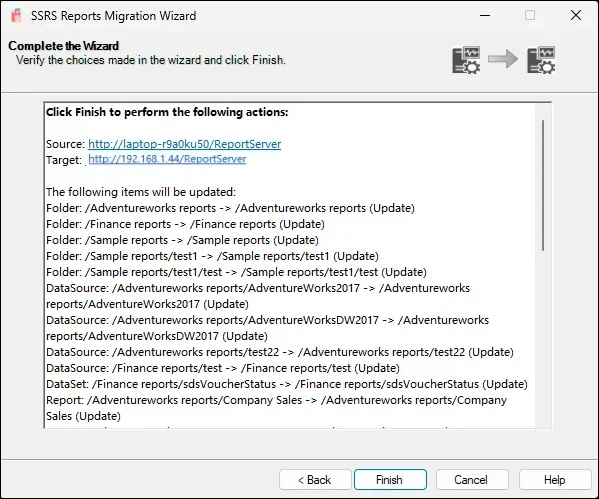
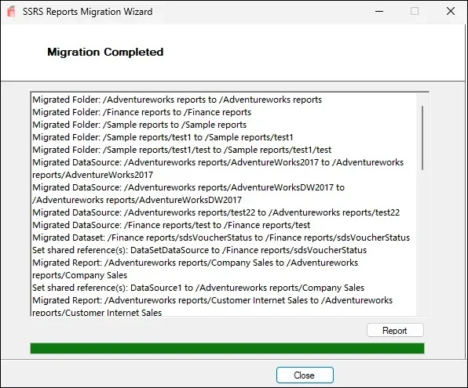

# Getting Started
{: .no_toc }

## Choose Source

- Choose the **source type**: either an SSRS Report Server or an SRMW file.
- Enter the **Report Server URI** (e.g., `http://localhost/ReportServer`).
- Select the **authentication method**:
  - Use Current Domain Credentials
  - Use Specified Domain Credentials (provide domain\username and password)
 

Click **Next** to proceed.

## Choose Target

- Choose the **target type**: another SSRS Report Server or SRMW file.
- Enter the **target server URI**.
- Provide authentication details as needed.

Click **Next** to continue.

## Select SSRS Items to Migrate

- Browse and select specific SSRS objects (folders, reports, datasets, data sources).
- The tool displays a **tree view** of your SSRS folder hierarchy.
- You can preview object counts by type on the right panel.
- Optionally, check **Migrate subscriptions** to include subscriptions.
- Optionally, check **Migrate roles** to include security roles at folder, report, dataset and datasource level.
- Optionally, check **Migrate parameters and defaults** to include report server side report parameters and their default values.

Click **Next** once you’ve selected the required items.

## Update Data Source Connections

The SSRS Reports Migration Wizard includes an optional step to update data source connection strings during the migration process. This is particularly useful when migrating reports and datasets from a source server to a target server that uses different connection details or data source configurations.

### How It Works

**Fetch Data Sources**  
On this screen, click the Fetch Data Sources button. The wizard will scan the selected SSRS items (from the previous screen) and populate a grid with all connections that can be updated.

Each row represents a unique connection used by your reports or shared data sources.

The grid displays the following information:

   - Extension – The type of data provider (e.g., SQL, OLEDB, Oracle).
   - Connection String – The current connection string used by the data source.
   - Credential Retrieval – Indicates the authentication method (Integrated, Store, None, or Prompt). If the method is Store, it appears in red, indicating that the password needs to be updated for this connection.
   - Embedded DS – The number of reports using this connection as an embedded data source.
   - Shared DS – The number of shared data sources using this connection. If this count is 0, it appears in red, indicating no existing shared data source currently uses this connection.
   - Manage – Click Edit to view or modify the connection details.

**View and Manage Connections**  
The grid displays the Extension, Connection String, and Credential Retrieval method for each data source. Click the **Edit** link in the **Manage** column, which allows you to modify the connection.

**Convert to shared data sources if connection exists** - If this option is selected, the wizard will attempt to convert embedded data sources in reports to shared data sources during deployment. A conversion will take place only if a shared data source is available in the selected SSRS items that matches on the properties Extension (provider type), ConnectionString, CredentialRetrieval (authentication mode), Windows or database credentials (including WindowsCredentials and ImpersonateUser), UserName (when using stored credentials). If all these attributes align, the embedded data source will be replaced with a reference to the matching shared data source.
     
**Update Properties**  
    When you click **Edit**, a new dialog box appears (labeled "Manage Connection Properties"). Here you can:
   - Review the Shared Data Source(s) using this connection and Report(s) using this connection as an embedded data source.
   - Modify the Connection String.
   - Specify Credentials (e.g., Windows credentials or a user name and password) under "Log into the data source".
     
If no shared data source currently exists for this connection, the dialog will allow you to add a new shared data source by specifying:
   - DataSourceName (for example, SalesDS)
   - DataSourcePath (for example, /Shared Data)
   - Click **Save** to apply the changes.

      

{: .note }
> 1. The wizard cannot retrieve passwords from embedded or shared data sources on the source report server. You must manually enter the credentials where required. 
>
> 2. The Dependent Objects shown in the grid are those that have an embedded connection. These objects directly use this connection. During migration, their embedded data sources can be converted into shared data sources, which will then point to the data source shown on this screen. This feature (Convert to shared data sources if connection exists) is optional.
>
> 3. The changes you make are **not committed to the target server** until the wizard completes the migration.  
>
> 4. If no connections are found for the selected items, a message box will inform you that there are no connections available for update.

## Manage File Share Subscription Credentials

If you have selected **Migrate subscriptions**, the wizard will automatically scan the source SSRS instance and detect subscriptions that use the File Share delivery method (i.e., exports reports to a network/shared folder).

Since SSRS does not return stored passwords for file-share subscriptions, the wizard provides a screen to collect network credentials required to successfully recreate these subscriptions on the target server.

On this screen:

  - Each row represents a unique Windows account used by file-share subscriptions
  - The shared folder path is shown for reference
  - The Password column must be filled in manually
  - You may click the Subscriptions hyperlink to view reports associated with that user

      

Once the credentials are entered, the wizard will apply them automatically while creating subscriptions on the target SSRS server.

{: .note }
> This step is only applicable for File Share subscriptions. If your subscriptions deliver via email or other methods, this screen can be skipped.
>

## Review and Confirm

### Before You Migrate (Checklist)
- Selected source and target correctly
- Chosen all intended SSRS items (reports, data sources, datasets, subscriptions)
- (Optional – BETA) Updated connection strings and provided credentials, if necessary
- Reviewed migration summary for “New” vs “Update” items  

Click **Finish** to start the migration process.

## Migration Summary

- View a detailed log of all migrated items.
- Warnings about existing folders or skipped operations will be shown.
- Click **Report** to view a full migration log or **Close** to exit the wizard.

## Grocery (Glossary) of Terms

| Term                          | Meaning | Example |
|-------------------------------|---------|---------------------------|
| **SRMW File**                 | A migration package created by the SSRS Reports Migration Wizard. It stores metadata about reports, datasets, data sources, subscriptions, and shared references, allowing migration without a live SSRS server. | UATserver.srmw |
| **Shared Data Source**        | A reusable data connection in SSRS. Multiple reports and datasets can share it. Updating the shared data source automatically updates all dependent reports. | `AdventureWorks2017` |
| **Embedded Data Source**      | A data connection defined inside a single report or dataset. Not reusable. Can be converted into a shared data source during migration if a matching one exists. | `Company Sales` report using `AdventureWorks` connection |
| **Dependent Objects**         | SSRS items (reports, datasets, etc.) that use a specific data source. | `Company Sales`, `Customer Internet Sales` |
| **Connection String**         | Defines the database server and catalog that SSRS connects to. | `Data Source=sqldev.ud3d.com,1113;Initial Catalog=AdventureWorks2017` |
| **Credential Retrieval**      | Defines how SSRS gets credentials for connecting to the database:  • **None** – no credentials provided  • **Integrated** – uses current Windows identity  • **Store** – uses stored username/password  • **Prompt** – asks user at runtime. | Store |
| **Windows Credentials**       | A flag indicating if the stored credentials are Windows domain credentials (e.g., `DOMAIN\User`) instead of SQL/database credentials. | False (Database user name and password) |
| **Impersonate User**          | Tells SSRS to impersonate the specified user when connecting to the data source (usually with Windows credentials). | False |
| **UseOriginalConnectString**  | Controls whether to keep the original connection string when migrating/deploying. If `True`, the original value is used; if `False`, the updated value is used. | True |
| **OriginalConnectStringExpressionBased** | Indicates whether the original connection string was an expression instead of a fixed string. |   `=Parameters!ServerName.Value`|
| **Subscription**              | A scheduled task that delivers reports automatically.  • **Standard Subscription** – uses fixed parameters/credentials.  • **Data-Driven Subscription** – dynamic recipients, parameters, and destinations. |  |

# Limitations

- If credentials are not configured, **subscriptions will fail to migrate**.
- Only **Native mode SSRS servers** are supported — **SharePoint mode is not supported**.
- There is no way to identify if a subscription already exists; re-migrating subscriptions for the same report will create duplicate subscriptions.

