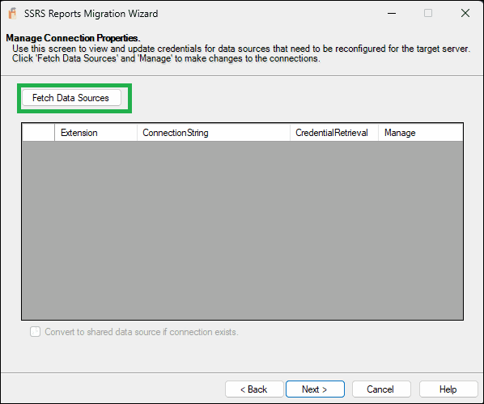

# Getting Started
{: .no_toc }

## Choose Source

- Choose the **source type**: either an SSRS Report Server or an SRMW file.
- Enter the **Report Server URI** (e.g., `http://localhost/ReportServer`).
- Select the **authentication method**:
  - Use Current Domain Credentials
  - Use Specified Domain Credentials (provide domain\username and password)
 

Click **Next** to proceed.

## Choose Target

- Choose the **target type**: another SSRS Report Server or SRMW file.
- Enter the **target server URI**.
- Provide authentication details as needed.

Click **Next** to continue.

## Select SSRS Items to Migrate

- Browse and select specific SSRS objects (folders, reports, datasets, data sources).
- The tool displays a **tree view** of your SSRS folder hierarchy.
- You can preview object counts by type on the right panel.
- Optionally, check **"Migrate standard subscriptions"** to include subscriptions.

Click **Next** once you’ve selected the required items.

## Update Data Source Connections 

SSRS Reports Migration Wizard now includes an optional step to update data source connection strings during the migration process. This is particularly useful when migrating reports and datasets from a source server to a target server that uses different connection details.

### How It Works

**Fetch Data Sources**  
On this screen, click the Fetch Data Sources button. The wizard will scan the selected SSRS items (from previous screen) and populate a grid with all connections that can be updated.

**View and Manage Connections**  
The grid displays the Extension, Connection String, and Credential Retrieval method for each data source. Click the **Edit** link in the **Manage** column, which allows you to modify the connection.

**Convert to shared data sources if connection exists** - If this option is selected, the wizard will attempt to convert embedded data sources in reports to shared data sources during deployment. A conversion will take place only if a shared data source is available in the selected SSRS items that matches on the properties Extension (provider type), ConnectionString, CredentialRetrieval (authentication mode), Windows or database credentials (including WindowsCredentials and ImpersonateUser), UserName (when using stored credentials). If all these attributes align, the embedded data source will be replaced with a reference to the matching shared data source.
     
**Update Properties**  
    When you click **Edit**, a new dialog box appears (labeled "Manage Connection Properties"). Here you can:
   - Review the Shared Data Source(s) using this connection and Report(s) using this connection as an embedded data source.
   - Modify the Connection String.
   - Specify Credentials (e.g., Windows credentials or a user name and password) under "Log into the data source".
   - Click **Save** to apply the changes.

      

{: .note }
The SSRS Reports Migration Wizard cannot retrieve passwords from embedded data sources on the source server. It is therefore essential to manually manage and input the connection strings with their corresponding passwords on this screen.
The *Dependent Objects* shown in the grid are those that have a connection embedded within them. These objects are directly using this connection.
The changes you make are **not committed to the target server** until the wizard completes the migration.
If no connections are found for the selected items, a message box will inform you that there are no connections available for update.

## Review and Confirm

### Before You Migrate (Checklist)
- Selected source and target correctly
- Chosen all intended SSRS items (reports, data sources, datasets, subscriptions)
- (Optional – BETA) Updated connection strings and provided credentials, if necessary
- Reviewed migration summary for “New” vs “Update” items  

Click **Finish** to start the migration process.

## Migration Summary

- View a detailed log of all migrated items.
- Warnings about existing folders or skipped operations will be shown.
- Click **Report** to view a full migration log or **Close** to exit the wizard.

# Limitations

- If credentials are not configured, **standard subscriptions will fail to migrate**.
- **Data-driven subscriptions are not supported.**
- Only **Native mode SSRS servers** are supported — **SharePoint mode is not supported**.

