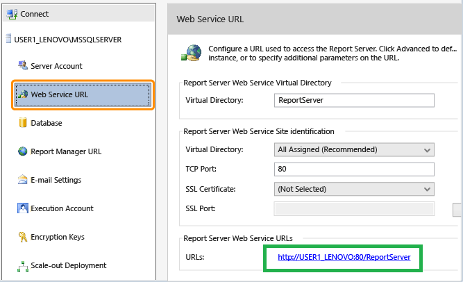

# Prerequisites

Before using the SSRS Reports Migration Wizard, ensure the following system, network, and access requirements are fulfilled.

## ✅ System Requirements

- **Windows OS** (Windows 10 or above recommended) or Windows Server.
- **.NET Framework 4.7.2 or above** installed
- Access to both **source** and **target SSRS / Power BI report servers**
- **SQL Server Agent Service (Required for Subscriptions):** Ensure the **SQL Server Agent** service is running on the target SQL Server instance that hosts the ReportServer database. This is **mandatory** for migrating and executing scheduled items, including all imported data-driven and standard subscriptions.

## 🌐 Network Prerequisites

- Ensure the SSRS server ports are open (default is **TCP 80** for HTTP).
- Firewalls or proxies should not block access to:
- `http://<servername>/ReportServer`
- `http://<servername>/Reports`

## 🔗 Report Server Access Requirements

🧑‍💼 **Required Roles**
- On the **source server**, your user must have at least the `Browser` role.
- On the **target server**, you need the `Publisher` role or higher.

> If connecting using domain credentials, ensure that:
> - The domain account is trusted on the report server
> - The password is valid and not expired

## 🔐 Granting Access to SSRS Report Server

If your user account is unable to connect or browse the server from the wizard, follow these steps to grant the required permissions:

### On the SSRS Web Portal (Report Manager):

1. Open your browser and navigate to the SSRS Web Portal (e.g.):http://<your-server>/Reports
2. 2. Click on the **gear icon** ⚙️ in the top-right corner and choose **Site Settings**.
3. Under **Security**, select **Add group or user**.
4. Enter your domain user name in this format:DOMAIN\username
5. Assign appropriate role(s):
- `Browser` – minimum required to view reports
- `Publisher` – required to publish/upload reports and data sources
- `Content Manager` – full access (if you’re managing everything)
6. Click **OK** to save.

### On Folder-Level Permissions (if restricted):

1. Navigate to the top-level folder (usually **Home**).
2. Click the **ellipsis (...)** next to the folder > **Manage** > **Security**.
3. Add your domain user again and assign the necessary role(s).
🔄 If inheritance is broken, ensure you set permissions for **each subfolder** as well.

## 🌐 How to Find the Report Server Web Service URL

To connect to your SSRS source or target environment using **SSRS Reports Migration Wizard**, you will need the **Report Server Web Service URL**. Follow the steps below to locate it.

### Using Report Server Configuration Manager

1. Launch **Report Server Configuration Manager** on the machine where SSRS is installed.
2. Connect to the appropriate SSRS instance.
3. Click on **Web Service URL** in the left-hand menu.
4. The full URL will be displayed under **Report Server Web Service URLs**.
   - Example: `http://<your-server-name>/reportserver`
5. Copy and use this URL in the wizard when prompted.

### If You Don’t Have Access to Configuration Manager

Try accessing the default SSRS URL directly in your browser:

- `http://localhost/reportserver`
- or `http://<your-server-name>/reportserver`

If SSRS is properly installed and running, this will open the Report Server endpoint.

### For HTTPS-Enabled Servers

If your SSRS instance is configured with SSL, the URL will begin with `https://`:

- Example: `https://reports.yourdomain.com/reportserver`

You can verify or update the SSL binding in the **Web Service URL** tab of the Configuration Manager.

### Optional: Check RSReportServer.config

The Web Service URL can also be located in the `RSReportServer.config` file at:  `C:\Program Files\Microsoft SQL Server\Reporting Services\ReportServer\`
Look for the `<UrlRoot>` tag to confirm the configured endpoint (if it exists).

## Next Step

Once all prerequisites are met, proceed to the [Getting Started Guide](./getting-started.md) to begin your migration.

