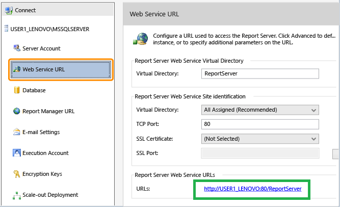

# Prerequisites

Before using the SSRS Reports Migration Wizard, ensure the following system, network, and access requirements are fulfilled.

## ✅ System Requirements

- **Windows OS** (Windows 10 or above recommended) or Windows Server.
- **.NET Framework 4.7.2 or above** installed
- Access to both **source** and **target SSRS / Power BI report servers**
- **SQL Server Agent Service (Required for Subscriptions):** Ensure the **SQL Server Agent** service is running on the target SQL Server instance that hosts the ReportServer database. This is **mandatory** for migrating and executing scheduled items, including all imported data-driven and standard subscriptions.

## 🌐 Network Prerequisites

- Ensure the SSRS server ports are open (default is **TCP 80** for HTTP).
- Firewalls or proxies should not block access to:
- `http://<servername>/ReportServer`
- `http://<servername>/Reports`


## Understanding SSRS Permissions

SSRS uses two separate permission layers. Both must be configured correctly depending on what you are migrating.

### Item-Level Roles

Assigned at the **Home** folder or subfolder level in the SSRS Web Portal. These roles control access to reports, datasets, data sources, and subscriptions.

| Role            | What it allows                                                                                                                        |
| --------------- | ------------------------------------------------------------------------------------------------------------------------------------- |
| Browser         | View reports, folders, and shared datasets. Minimum role required for reading from the source server.                                 |
| Publisher       | Deploy reports, datasets, and data sources to the target server.                                                                      |
| Content Manager | Full control of items, including create, edit, delete, and manage security. Required for subscription migration on the target server. |

### Site-Level Roles

Assigned under **Site Settings → Security** in the SSRS Web Portal. These roles are separate from folder-level permissions and are required for:

* Retrieving or migrating shared schedules
* Migrating security roles across servers
* Accessing system-level metadata during migration

| Role                 | What it allows                                                                               |
| -------------------- | -------------------------------------------------------------------------------------------- |
| System User          | View shared schedules and site properties. Minimum role required for subscription migration. |
| System Administrator | Full system control. Required for role migration and shared schedule management.             |

> ⚠️ **Important:** Missing site-level roles are the most common cause of HTTP 500 errors during migration. If the Migration Wizard returns a 500 error when retrieving shared schedules, verify that the account has the required site-level permissions.


## 🔗 Report Server Access Requirements

The permissions you need depend on what you are migrating. Use the table below to identify the minimum roles required for your scenario.

| What you're migrating                    | Source (minimum)                                                | Target (minimum)                       |
| ---------------------------------------- | --------------------------------------------------------------- | -------------------------------------- |
| Reports, folders, datasets, data sources | Browser                                                         | Publisher                              |
| Subscriptions (standard)                 | Browser + System User                                           | Content Manager                        |
| Data-driven subscriptions                | Browser + System User                                           | Content Manager                        |
| Shared schedules                         | System User with schedule permissions (or System Administrator) | System Administrator                   |
| Roles and permissions                    | System Administrator                                            | System Administrator                   |
| Linked reports                           | Browser (on parent report folder)                               | Publisher                              |
| Full server migration (all of the above) | Content Manager + System Administrator                          | Content Manager + System Administrator |

> **Recommendation:** If you have administrative access, assign **Content Manager** (item-level) and **System Administrator** (site-level) roles on both the source and target report servers. This eliminates most permission-related errors and ensures all migration features work correctly.

---
## Domain Credential Requirements

* The account must be a valid domain account trusted by the report server. Local machine accounts are not supported.

* Ensure the account password is valid and not expired. Expired credentials can cause silent connection failures.

* If the Migration Wizard cannot connect, verify that the account can access the following URL directly in a browser:

  ```text
  http://<servername>/ReportServer
  ```

* When connecting across domains, ensure the account is explicitly trusted and authorized on the target report server.

## 🔐 How to Grant Item-Level Access (Folder Permissions)

Use this procedure when migrating reports, datasets, data sources, or subscriptions.

1. Open the SSRS Web Portal:

   ```text
   http://<servername>/Reports
   ```

2. Navigate to the **Home** folder (or the specific folder you need to migrate).

3. Click the **ellipsis (...)** next to the folder and select **Manage → Security**.

4. Click **Add group or user**.

5. Enter the account in the following format:

   ```text
   DOMAIN\username
   ```

6. Assign the appropriate role from the table above.

7. Click **OK** to save the changes.

> 🔄 **Note:** If permission inheritance has been broken on subfolders, permissions must be assigned individually to each subfolder. The Migration Wizard can only access items that the connecting account has permission to read.

### Folder-Level Permissions (When Access Is Restricted)

If access to the **Home** folder is restricted or inheritance has been broken:

1. Navigate to the required top-level folder in the SSRS Web Portal.
2. Click the **ellipsis (...)** next to the folder and select **Manage → Security**.
3. Add the required domain account and assign the appropriate role.
4. Repeat for each subfolder where inheritance has been disabled.

---

## 🔐 How to Grant Site-Level Access (System Permissions)

Use this procedure when migrating shared schedules, subscriptions, or security roles.

1. Open the SSRS Web Portal:

   ```text
   http://<servername>/Reports
   ```

2. Click the **Settings (⚙️)** icon in the upper-right corner and select **Site Settings**.

3. Select **Security** from the left navigation pane.

4. Click **Add group or user**.

5. Enter the account in the following format:

   ```text
   DOMAIN\username
   ```

6. Assign the appropriate role:

   * **System User** – Required for subscription and shared schedule migration.
   * **System Administrator** – Required for role migration and advanced schedule management.

7. Click **OK** to save the changes.

---

## 🌐 How to Find the Report Server Web Service URL

To connect to your SSRS source or target environment using **SSRS Reports Migration Wizard**, you will need the **Report Server Web Service URL**. Follow the steps below to locate it.

### Using Report Server Configuration Manager

1. Launch **Report Server Configuration Manager** on the machine where SSRS is installed.
2. Connect to the appropriate SSRS instance.
3. Click on **Web Service URL** in the left-hand menu.
4. The full URL will be displayed under **Report Server Web Service URLs**.
   - Example: `http://<your-server-name>/reportserver`
5. Copy and use this URL in the wizard when prompted.



### If You Don’t Have Access to Configuration Manager

Try accessing the default SSRS URL directly in your browser:

- `http://localhost/reportserver`
- or `http://<your-server-name>/reportserver`

If SSRS is properly installed and running, this will open the Report Server endpoint.

### For HTTPS-Enabled Servers

If your SSRS instance is configured with SSL, the URL will begin with `https://`:

- Example: `https://reports.yourdomain.com/reportserver`

You can verify or update the SSL binding in the **Web Service URL** tab of the Configuration Manager.

### Optional: Check RSReportServer.config

The Web Service URL can also be located in the `RSReportServer.config` file at:  `C:\Program Files\Microsoft SQL Server\Reporting Services\ReportServer\`
Look for the `<UrlRoot>` tag to confirm the configured endpoint (if it exists).


## Next Step

Once all prerequisites are met, proceed to the [Getting Started Guide](https://ssrsmigrationwizard.azureops.org/getting-started/) to begin your migration.

